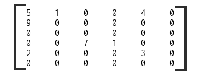

# Seminarska naloga za predmet PS - Porazdeljeni sistemi 
Cilj: Učinkovita paralelna implementacija algoritma pagerank. [1]

## TODO list / Roadmap
* [x] Referenčna implementacija za pomoč pri razvoju pravilnega single threaded C programa
* [x] Single threaded C program
* [x] Implementacija formatov ELL in COO ter hibridnega formata (ELL + COO)
* [x] Paralelizacija single threaded programa, najlažje verjetno OpenMP, paralelizira se vse kar se da. (Branje in pretvorba v kompakten coo format sta sekvenčna, pretvorba potem v specifičen format in sam izračun pa sta paralelna)
* [ ] OpenCL implementacija s CSR, COO, HYBRID
* [ ] Double vs single precision na GPU
* [ ] OpenCL na dveh grafičnih karticah. (Na arnesu so na vsakem od vozlišč wn201-224 po 2 Nvidia V100) 
* [ ] Če bo čas mogoče: OpenCL + MPI na Arnesovi gruči (24x Nvidia V100), treba se pozanimat kako usposobit MPI
* [ ] Izbira podatkovnih zbirk za benchmarking
* [ ] Benchmarking
* [ ] Predstavitev s povzetki rezultatov: grafi, povprečje + std. odklon, ...

## Formati za shranjevanje redkih matrik (Sparse matrices)
Naj bo podana matrika: 

### COO - Coordinate format
Za vsako neničelno vrednost zapišemo vrstico, stolpec in vrednost.

Primer:

Vrednost: 5, 1, 4, 9, 7, 1, 2, 3

Vrstica:  0, 0, 0, 1, 3, 3, 4, 4

Stolpec:  0, 1, 5, 0, 2, 3, 0, 3

### CSR - Compressed row storage
Vrednosti in stolpce hranimo na isti način kot pri COO. Za vsako vrstico pa si shranimo indek prve vrednosti v tej vrstici. Dolžina seznama, ki hrani podatke o vrsticah je torej 6+1 (dimenzija matrike + 1)
V i-ti vrstici so torej elementi: {vrednost[k] | vrstica[i] <= k < vrstica[i+1]}

Primer:

Vrednost: 5, 1, 4, 9, 7, 1, 2, 3

Stolpec:  0, 1, 5, 0, 2, 3, 0, 3

Vrstica:  0, 3, 4, 4, 6, 8, 8

### ELL

## Testne datoteke
V zbirki SuiteSparse Matrix Collection (predhodno znana kot University of Florida Sparse Matrix Collection) najdemo primerke sparse matrik, pridobljenih z webcrawlanjem resničnih podatkov na neki podmnožici celotnega interneta. Ti podatki so veliko bolj realen preizkus implementacije algoritma pagerank, kot bi bili kakšni naključno generirani podatki ter so že v željenem formatu (Matrix market).

Povezava do te zbirke je [2]. Ker se včasih prenos ne začne, je alternativna povezava [3], na kateri je bila zbirka originalno dostopna. Matirke, ki jih uporabljamo so dostopne na obeh povezavah.

Moramo pa se potruditi, da izberemo primerne podatke, ki bodo vsaj približno enakomerno razporejeni po velikosti, glede na število neničelnih elementov. Izbiramo med tistimi, ki jih najde iskalni niz 'web' in so tipa 'directed graph'. Predlagam naslednje podatkovne sete, da vidimo kaj zmore naša implementacija:

Opomba: Po nekaj testiranja sem ugotovil, da je že pri primeru 4 čas branja iz datoteke (velika je 4.7GB) zelo velik, ~1 minuto na mojem računalniku. Zato predlagam, da benchmarkamo v glavnem z zbirkami 1,2,3 in 4, ter uporabimo 5,6,7 mogoče le za kakšen specifičen test.

1. [Google example](https://sparse.tamu.edu/SNAP/web-Google)
    * Rows & cols: 916,428
    * Nonzeros: 5,105,039

2. [Some .eu domains, 2005](https://sparse.tamu.edu/LAW/eu-2005)
    * Rows & cols: 862,664
    * Nonzeros: 19,235,140

3. [.edu domains, 2001](https://sparse.tamu.edu/Gleich/wb-edu)
    * Rows & cols: 9,845,725
    * Nonzeros: 57,156,537

4. [UK (.uk domains), 2002](https://sparse.tamu.edu/LAW/uk-2002)
    * Rows & cols: 18,520,486
    * Nonzeros: 298,113,762

5. [Arabic, 2005](https://sparse.tamu.edu/LAW/arabic-2005)
    * Rows & cols: 22,744,080
    * Nonzeros: 639,999,458

6. [Italy (.it domains), 2004](https://sparse.tamu.edu/LAW/it-2004)
    * Rows & cols: 41,291,594
    * Nonzeros: 1,150,725,436

7. [Slovakia (.sk domains), 2005](https://sparse.tamu.edu/LAW/sk-2005)
    * Rows & cols: 50,636,154
    * Nonzeros: 1,949,412,601

## Reference 
[1] The PageRank Citation Ranking: Bringing Order to the Web (http://ilpubs.stanford.edu:8090/422/)

[2] The SuiteSparse Matrix Collection (https://sparse.tamu.edu/)

[3] UF Sparse Matrix Collection, sorted by id (https://www.cise.ufl.edu/research/sparse/matrices/list_by_id.html)

## Ostala literatura

[i] Sparse Matrix Data Structures for High Performance Computing (https://faculty.cc.gatech.edu/~echow/ipcc/hpc-course/sparsemat.pdf)

[ii] Sparse Matrix-Vector Multiplication and Matrix Formats (https://www.it.uu.se/education/phd_studies/phd_courses/pasc/lecture-1)

[iii] How naive is naive SpMV on the GPU? (https://people.mpi-inf.mpg.de/~rzayer/pappe/HowNaiveIsNaiveSpmvOnTheGpu.pdf)

[iv] The API reference guide for cuSPARSE, the CUDA sparse matrix library (https://docs.nvidia.com/cuda/cusparse/index.html)

[v] Characterizing Dataset Dependence for Sparse Matrix-Vector Multiplication on GPUs (https://www.cs.colostate.edu/~pouchet/doc/ppaa-article.15.pdf)

[vi] Performance optimization using partitioned SpMV on GPUs and multicore CPUs (https://www.researchgate.net/figure/The-optimization-workflow-for-SpMV-using-COO-CSR-and-ELL-Algorithm-1-Performance_fig1_280970750)

[vii] Sparse matrix partitioning for optimizing SpMV on CPU-GPU heterogeneous platforms (https://journals.sagepub.com/doi/pdf/10.1177/1094342019886628)

