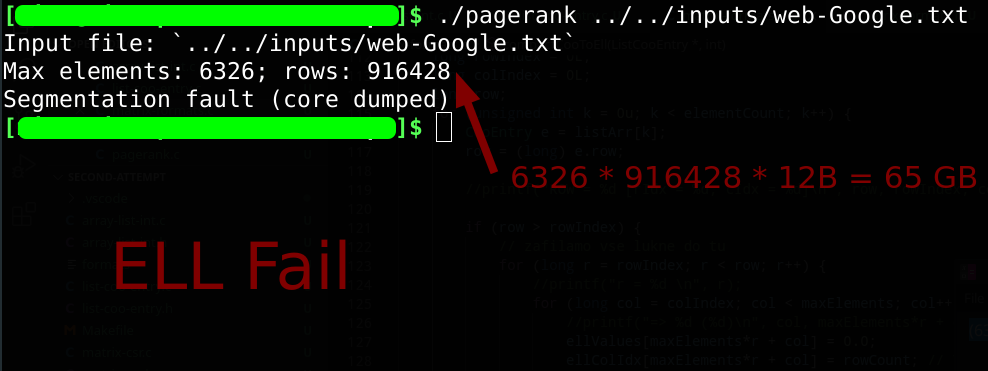

# Seminarska naloga za predmet PS - Porazdeljeni sistemi 
Cilj: Učinkovita paralelna implementacija algoritma pagerank. [1]

## TODO list / Roadmap
* [x] Referenčna implementacija za pomoč pri razvoju pravilnega single threaded C programa
* [x] Single threaded C program
* [x] Implementacija formatov ELL in COO ter hibridnega formata (ELL + COO)
* [x] Paralelizacija single threaded programa, najlažje verjetno OpenMP, paralelizira se vse kar se da. (Branje in pretvorba v kompakten coo format sta sekvenčna, pretvorba potem v specifičen format in sam izračun pa sta paralelna)
* [ ] OpenCL implementacija s CSR, COO, HYBRID
* [ ] Double vs single precision na GPU
* [ ] OpenCL na dveh grafičnih karticah. (Na arnesu so na vsakem od vozlišč wn201-224 po 2 Nvidia V100) 
* [ ] (Če bo čas mogoče: OpenCL + MPI na Arnesovi gruči (24x Nvidia V100), treba se pozanimat kako usposobit MPI)
* [ ] Izbira podatkovnih zbirk za benchmarking
* [ ] Benchmarking
* [ ] Predstavitev s povzetki rezultatov: grafi, povprečje + std. odklon, ...

### Komentarji na TODO
Za GPU vzamemo za osnovo pagerank single threaded implementacijo.

Testira se 3 formate, in sicer CSR, COO in HYBRID. Pretvorba iz kompaktnega formata se izvede enonitno, beleži se čase kot pri implementaciji za CPU; READ, PREPare, CONVert, CALCulate. Pomemben je zlasti čas calculate, za primerjavo s openmp pa še convert.

Doda se OpenCL boilerplate (predvsem mislim na kopiranje pomnilnika) ter ščepce. Doda se profiliranje (točno merjenje časa izvajanja ščepca).

Potrebna bo globalna sinhronizacija po vsaki iteraciji (mogoče se znotraj istega ščepca poračuna tudi norma, pri tem naj grejo delni rezultati vsake niti v register, ter rezultati delovne skupine v lokalni pomnilnik, v delovni skupini se izvede podobna redukcija kot pri skalarnem produktu na predavanjih; zadnji del redukcije pa še na gostitelju) , za kar uporabimo gostitelja ter nato ponovno poženemo ščepec, pomnilnika pa se ohrani stari.

Najprej naj dela zgoraj našteto na kateri od manjših podatkovnih zbirk, nato na uk-2002 in nato se implementirajo stvari naprej:
* double vs single precision
* 2 GPU-ja
* morebiti OpenCL + MPI

Za testiranje se uporabi arnesovo gručo, vozlišča wn201-224.

## Formati za shranjevanje redkih matrik (Sparse matrices)
Naj bo podana matrika: 

### COO - Coordinate format
Za vsako neničelno vrednost zapišemo vrstico, stolpec in vrednost.

Primer:

Vrednost: 5, 1, 4, 9, 7, 1, 2, 3

Vrstica:  0, 0, 0, 1, 3, 3, 4, 4

Stolpec:  0, 1, 5, 0, 2, 3, 0, 3

### CSR - Compressed row storage
Vrednosti in stolpce hranimo na isti način kot pri COO. Za vsako vrstico pa si shranimo indek prve vrednosti v tej vrstici. Dolžina seznama, ki hrani podatke o vrsticah je torej 6+1 (dimenzija matrike + 1)
V i-ti vrstici so torej elementi: {vrednost[k] | vrstica[i] <= k < vrstica[i+1]}

Primer:

Vrednost: 5, 1, 4, 9, 7, 1, 2, 3

Stolpec:  0, 1, 5, 0, 2, 3, 0, 3

Vrstica:  0, 3, 4, 4, 6, 8, 8

### ELL
Recimo, da imamo sparse matriko, ki ima skoraj enako elementov v vsaki vrstici. Potem lahko matriko skrčimo na matriko, ki je široka toliko kot je največ elementov v neki vrstici in ima enako število vrstic. Neničelne elemente zapišemo v skrčeno matriko v istoležno vrstico, po naraščajočih stolpcih. Poleg te matrike potrebujemo še matriko enake velikosti, ki bo hranila dejanski stolpec za vsak element.

Vrstice, ki nimajo dovolj elementov, da bi zapolnile celotno skrčeno matriko dopolnimo z neveljavnimi vrednostmi.

Primer:

Max št. elementov v vrstici je 3

Skrčena matrika:
TODO

Matrika indeksov stolpcev:
TODO

### Hybrid - ELL + COO
ELL format je zelo potraten, primer: 

Zato uporabimo kombinacijo ELL + COO. Najprej določimo koliko elementov na vrstico bo šlo v ELL, ponavadi vzamemo kar povprečje, elemente iz daljših vrstic pa damo v COO. Tako smo izhodiščno matriko razbili na vsoto dveh matrik, zmnožimo kot: (A+B)x = Ax + Bx.
Opomba, za naše primere gre ZELO malo elementov v ELL; če vzamemo podatkovno zbirko uk-2002 in velikost vrstice 16 (povprečno št. elementov na vrstico). Gre v ELL le 26% elementov (78 259 781 od 298 113 762), ostali v COO. Pri 32: 41,5%. Pri 64: 50.2%. Poraba pomnilnika je: pri 16: 3,3GB, 32: 6,6GB, 64: 13,2GB.
TODO: dodaj graf razporeditve

Zakaj se sploh ubadati z ELL formatom?
Zasnova GPU veleva, da lahko niti v snopu učinkovito hkrati dostopajo do zaporednih pomnilniških lokacij. Če matriko ELL implementiramo kot 1D vektor po stolpcih ter vsaki niti na GPU dodelimo množenje 1 vrstice, bo snop lahko učinkovito dostopal do pomnilnika, saj bo hkrati prenesel 1. element za 32 vrstic, na to 2. element za 32 vrstic...

## Testne datoteke
V zbirki SuiteSparse Matrix Collection (predhodno znana kot University of Florida Sparse Matrix Collection) najdemo primerke sparse matrik, pridobljenih z webcrawlanjem resničnih podatkov na neki podmnožici celotnega interneta. Ti podatki so veliko bolj realen preizkus implementacije algoritma pagerank, kot bi bili kakšni naključno generirani podatki ter so že v željenem formatu (Matrix market). Potrebno pa je odstraniti prvih nekaj vrstic (kar se začne s % in tisto vrstico, ki ima podatek o št. vrstic in neničelnih elementov - 3 elemente)

Povezava do te zbirke je [2]. Ker se včasih prenos ne začne, je alternativna povezava [3], na kateri je bila zbirka originalno dostopna. Matirke, ki jih uporabljamo so dostopne na obeh povezavah.

Moramo pa se potruditi, da izberemo primerne podatke, ki bodo vsaj približno enakomerno razporejeni po velikosti, glede na število neničelnih elementov. Izbiramo med tistimi, ki jih najde iskalni niz 'web' in so tipa 'directed graph'. Predlagam naslednje podatkovne sete, da vidimo kaj zmore naša implementacija:

Opomba: Po nekaj testiranja sem ugotovil, da je že pri primeru 4 čas branja iz datoteke (velika je 4.7GB) zelo velik, ~1 minuto na mojem računalniku. Zato predlagam, da benchmarkamo v glavnem z zbirkami 1,2,3 in 4, ter uporabimo 5,6,7 mogoče le za kakšen specifičen test.

1. [Google example](https://sparse.tamu.edu/SNAP/web-Google)
    * Rows & cols: 916,428
    * Nonzeros: 5,105,039

2. [Some .eu domains, 2005](https://sparse.tamu.edu/LAW/eu-2005)
    * Rows & cols: 862,664
    * Nonzeros: 19,235,140

3. [.edu domains, 2001](https://sparse.tamu.edu/Gleich/wb-edu)
    * Rows & cols: 9,845,725
    * Nonzeros: 57,156,537

4. [UK (.uk domains), 2002](https://sparse.tamu.edu/LAW/uk-2002)
    * Rows & cols: 18,520,486
    * Nonzeros: 298,113,762

5. [Arabic, 2005](https://sparse.tamu.edu/LAW/arabic-2005)
    * Rows & cols: 22,744,080
    * Nonzeros: 639,999,458

6. [Italy (.it domains), 2004](https://sparse.tamu.edu/LAW/it-2004)
    * Rows & cols: 41,291,594
    * Nonzeros: 1,150,725,436

7. [Slovakia (.sk domains), 2005](https://sparse.tamu.edu/LAW/sk-2005)
    * Rows & cols: 50,636,154
    * Nonzeros: 1,949,412,601

## Reference 
[1] The PageRank Citation Ranking: Bringing Order to the Web (http://ilpubs.stanford.edu:8090/422/)

[2] The SuiteSparse Matrix Collection (https://sparse.tamu.edu/)

[3] UF Sparse Matrix Collection, sorted by id (https://www.cise.ufl.edu/research/sparse/matrices/list_by_id.html)

## Ostala literatura

[i] Sparse Matrix Data Structures for High Performance Computing (https://faculty.cc.gatech.edu/~echow/ipcc/hpc-course/sparsemat.pdf)

[ii] Sparse Matrix-Vector Multiplication and Matrix Formats (https://www.it.uu.se/education/phd_studies/phd_courses/pasc/lecture-1)

[iii] How naive is naive SpMV on the GPU? (https://people.mpi-inf.mpg.de/~rzayer/pappe/HowNaiveIsNaiveSpmvOnTheGpu.pdf)

[iv] The API reference guide for cuSPARSE, the CUDA sparse matrix library (https://docs.nvidia.com/cuda/cusparse/index.html)

[v] Characterizing Dataset Dependence for Sparse Matrix-Vector Multiplication on GPUs (https://www.cs.colostate.edu/~pouchet/doc/ppaa-article.15.pdf)

[vi] Performance optimization using partitioned SpMV on GPUs and multicore CPUs (https://www.researchgate.net/figure/The-optimization-workflow-for-SpMV-using-COO-CSR-and-ELL-Algorithm-1-Performance_fig1_280970750)

[vii] Sparse matrix partitioning for optimizing SpMV on CPU-GPU heterogeneous platforms (https://journals.sagepub.com/doi/pdf/10.1177/1094342019886628)

